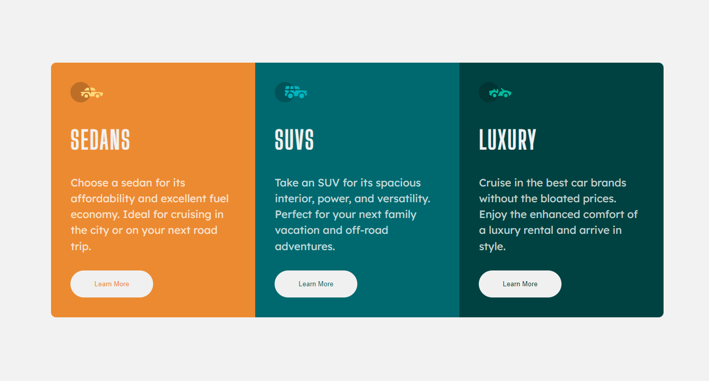
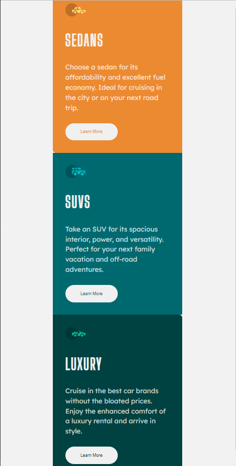

# Frontend Mentor - 3-column preview card component solution

This is a solution to the [3-column preview card component challenge on Frontend Mentor](https://www.frontendmentor.io/challenges/3column-preview-card-component-pH92eAR2-). Frontend Mentor challenges help you improve your coding skills by building realistic projects. 

## Table of contents

- [Overview](#overview)
  - [The challenge](#the-challenge)
  - [Screenshot](#screenshot)
  - [Links](#links)
- [My process](#my-process)
  - [Built with](#built-with)
  - [What I learned](#what-i-learned)
  - [Continued development](#continued-development)
  - [Useful resources](#useful-resources)
- [Author](#author)
- [Acknowledgments](#acknowledgments)

## Overview

### The challenge

Users should be able to:

- View the optimal layout depending on their device's screen size
- See hover states for interactive elements

### Screenshot

### Links

- Solution URL: [Git Repo](https://github.com/Robert-Thaiyah/3-column-card)
- Live Site URL: [Add live site URL here](https://your-live-site-url.com)

## My process

- First I created and perfected the first card to closely resemble the given image.
- Then I duplicated the rest of the two cards and changed the color, text and border radius. 

### Built with

- Semantic HTML5 markup
- CSS custom properties
- Flexbox
- CSS Grid
- Mobile-first workflow

### What I learned

- Mobile Viewport heights

### Continued development

Daily practise on mobile views.

### Useful resources

- [Unset Property](https://developer.mozilla.org/en-US/docs/Web/CSS/unset) - This helped me understand fully the unset property and how it is used on mobile view.

## Author

- Website - [Robert Thaiyah](https://github.com/Robert-Thaiyah)

## Acknowledgments

Thanks for the challenge. 
